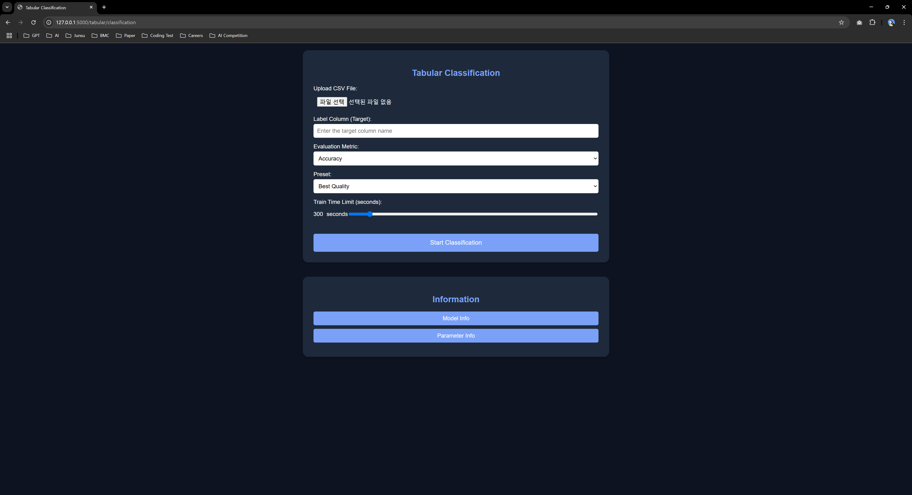

# BMC Medical AutoGluon

> An automated machine learning platform for medical data analysis, utilizing AutoGluon to perform classification and regression on tabular and image data.

## Table of Contents
- [Overview](#overview)
- [Screenshots](#screenshots)
- [Features](#features)
- [System Architecture](#system-architecture)
- [Prerequisites](#prerequisites)
- [Installation](#installation)
- [Usage](#usage)
- [API Documentation](#api-documentation)
- [Development](#development)
- [License](#license)
- [Authors](#authors)

## Overview

BMC Medical AutoGluon is an automated machine learning platform for medical data analysis. Built on the AutoGluon framework, it automatically performs classification and regression analysis on complex medical data.

## Screenshots


*Data type selection screen*


*Tabular classification configuration screen*


*Classification model performance and analysis results*


*Regression analysis configuration screen*


*Regression model performance and analysis results*

## Features

- **Tabular Classification**
  - Automated multi-class model training
  - Model performance evaluation and visualization
  - Feature importance analysis
  - Confusion matrix and ROC curve generation

- **Tabular Regression**
  - Automated regression model training
  - Performance metrics (RMSE, MAE, R²)
  - Actual vs Predicted analysis
  - Residual analysis and visualization

- **Image Classification** (Coming Soon)
  - Medical image classification model training
  - Class-wise performance analysis
  - Prediction probability visualization

- **Object Detection** (Coming Soon)
  - Object detection in medical images
  - Bounding box visualization
  - Detection accuracy analysis

## System Architecture

1. **Web Interface**
   - Flask-based web application
   - Responsive design
   - Real-time training progress display

2. **AutoML Engine**
   - AutoGluon-based automated model training
   - Hyperparameter optimization
   - Ensemble model generation

3. **Results Analysis System**
   - Interactive visualizations
   - Performance metrics calculation
   - Model interpretation capabilities

## Prerequisites

- Python 3.8+
- AutoGluon 0.7+
- Flask 2.0+
- pandas, numpy, matplotlib
- scikit-learn

## Installation

1. Clone the repository
```bash
git clone https://github.com/Junsu0213/bmc-medical-autogluon.git
cd bmc-medical-autogluon
```

2. Install dependencies
```bash
pip install -r requirements.txt
```

## Usage

1. Start the server
```bash
python app.py
```

2. Access in web browser
```bash
http://localhost:5000
```

## API Documentation

### Train Classification Model

- **URL**: `/api/tabular/classification`
- **Method**: `POST`
- **Request Body**: 
  - `data_file`: CSV file
  - `label_column`: Target variable name
  - `eval_metric`: Evaluation metric
  - `preset`: Training configuration
  - `time_limit`: Training time limit

### Train Regression Model

- **URL**: `/api/tabular/regression`
- **Method**: `POST`
- **Request Body**: 
  - `data_file`: CSV file
  - `label_column`: Target variable name
  - `eval_metric`: Evaluation metric
  - `preset`: Training configuration
  - `time_limit`: Training time limit

## Development

1. Set up development environment
```bash
pip install -r requirements-dev.txt
```

2. Run tests
```bash
pytest tests/
```

## License

This project is licensed under the MIT License.

## Authors

- **Developer**: JUN-SU PARK
- **Email**: junsupark0213@amc.seoul.kr
- **Project Link**: https://github.com/Junsu0213/bmc-medical-autogluon
```